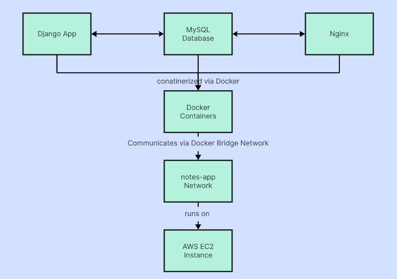

# 🚀 DevOps Project: Three-Tier Notes App with Django, MySQL, Nginx, Jenkins CI/CD & Kubernetes (Dockerized on AWS EC2 with KIND)

This project demonstrates a **production-ready three-tier web application** using:
- **Django** as the web framework for the Notes app
- **MySQL** as the relational database
- **Nginx** as the reverse proxy server

Everything is containerized using **Docker Compose** and structured for easy deployment, both locally and on **AWS EC2**.

---

## 🌟 Key Features

- 🔌 **Three-Tier Architecture**: Decoupled services for better maintainability and scalability
- 🌐 **Nginx as Reverse Proxy**: Routes traffic to Django container efficiently
- 💾 **MySQL Persistence**: Uses Docker volumes to preserve database state
- 🐳 **Fully Dockerized**: Quick spin-up with `docker-compose up`
- 💡 **Gunicorn**: Runs Django in a production-ready WSGI server
- 🧪 **Health Checks**: Container-level health monitoring
- 🔐 **Environment Variables**: Secure configuration using `.env` file

---

## 🏗️ Architecture Overview


## 📁 Project Structure

```

Devops-3Tier-Project/
├── api/
├──k8s/
│ └── namespace.yml
│ └── deployment.yml
│ └── service.yml
├── mynotes/ # Frontend 
├── nginx/
│ └── default.conf # Nginx reverse proxy configuration
| └── Dockerfile # Dockerfile for Nginx
├── notesapp/ # Django project folder (with settings.py, wsgi.py)
├── staticfiles/ # Collected static files (served by Nginx)
├── .env # Environment variables for Django and DB
├── .gitignore
├── db.sqlite3 # (Optional) SQLite fallback DB (ignored in prod)
├── docker-compose.yml # Docker Compose configuration
├── Dockerfile # Dockerfile for Django app
├── Jenkinsfile # Jenkinsfile for CI/CD Pipeline
├── manage.py # Django's entry point
├── README.md # You're here!
└── requirements.txt # Python dependencies

````

---

## ⚙️ Docker Services Overview

| Service  | Description                      | Port Mapping |
|----------|----------------------------------|--------------|
| `nginx`  | Reverse proxy for Django app     | `80:80`      |
| `django` | Django + Gunicorn backend        | `8000:8000`  |
| `db`     | MySQL database                   | `3306:3306`  |

---

## 🧑‍💻 Getting Started

### Prerequisites

- Docker & Docker Compose installed
- AWS account (for EC2 deployment)
- Basic knowledge of Docker and Django

---

## 🔧 Local Development Setup

```bash
# Clone the repository
https://github.com/Pranay-Rokade/Devops-3Tier-Project.git
cd Docker-3Tier-Project

# Build and run all containers
docker-compose up --build
````

* The Django app will be accessible at: `http://localhost:80`
* Django admin panel (after migrations): `http://localhost:80/admin`

---

## ☁️ AWS EC2 Deployment Steps

1. **Launch EC2 Instance**:

   * AMI: Ubuntu 24.04 LTS
   * Instance Type: t2.micro (or higher)
   * Open ports 22 (SSH), 80 (HTTP), and 3306 (if needed externally)

2. **Connect to EC2**:

```bash
chmod 400 your-key.pem
ssh -i "your-key.pem" ubuntu@<EC2-Public-IP>
```

3. **Install Docker**:

```bash
sudo apt update
sudo apt install -y docker.io docker-compose-v2
sudo systemctl enable docker
```

4. **Deploy the Application**:

```bash
git clone https://github.com/Pranay-Rokade/Devops-3Tier-Project
cd Docker-3Tier-Project
docker-compose up --build -d
```
* The Django app will be accessible at: `http://EC2-Public-IP:80/`

---

## 🔍 Health Check and Troubleshooting

Check the status of running containers:

```bash
docker ps
```

Logs for a specific container:

```bash
docker logs <container_name>
```

Enter the MySQL container to inspect the DB:

```bash
docker exec -it db_cont bash
mysql -uroot -proot
```

---

## 🌐 Accessing the Application

```text
http://<EC2-Public-IP>:80/
```

You can also access the Django admin:

```text
http://<EC2-Public-IP>/admin
```

---

## ☸️ Kubernetes Deployment using KIND on EC2

In addition to Docker Compose, this project also supports deployment via Kubernetes using Kind (Kubernetes IN Docker), a lightweight local Kubernetes cluster.

### 📦 Environment: AWS EC2 + KIND

The Kubernetes cluster was set up on an EC2 instance using the following:

- **AMI**: Ubuntu 24.04 LTS  
- **Instance Type**: t2.micro (or higher)  
- **Tools Installed**: docker.io, kind, kubectl  

### 🛠️ Setup Steps on EC2

#### ✅ 1. Install Docker

```bash
sudo apt update
sudo apt install -y docker.io
sudo usermod -aG docker $USER
newgrp docker
```

#### ✅ 2. Install KIND

```bash
curl -Lo ./kind https://kind.sigs.k8s.io/dl/v0.22.0/kind-linux-amd64
chmod +x ./kind
sudo mv ./kind /usr/local/bin/kind
```

#### ✅ 3. Install kubectl

```bash
curl -LO "https://dl.k8s.io/release/$(curl -s https://dl.k8s.io/release/stable.txt)/bin/linux/amd64/kubectl"
chmod +x kubectl
sudo mv kubectl /usr/local/bin/
```

#### ✅ 4. Create Kind Cluster

```bash
kind create cluster --name notes-cluster
```

### 📄 Kubernetes Manifests

The Kubernetes manifests are located inside the `k8s/` directory:

```
k8s/
├── namespace.yml     # Namespace definition for isolation
├── deployment.yml    # Deploys the Django app container
├── service.yml       # Exposes Django app inside the cluster
```

You can apply them using:

```bash
kubectl apply -f k8s/namespace.yml
kubectl apply -f k8s/deployment.yml
kubectl apply -f k8s/service.yml
```

### 🌐 Accessing the Application (Port Forwarding)

To expose the Django app running inside the Kubernetes cluster:

```bash
kubectl port-forward service/notes-app-service -n notes-app 8000:8000 --address=0.0.0.0
```

Now visit your browser at:

```
http://<EC2-Public-IP>:8000/
```

### 🔐 Notes & Suggestions

- ✅ Consider setting up an Ingress Controller (e.g., Nginx Ingress) for production routing  
- 🔐 Use Secrets for DB passwords and sensitive env variables  
- 💾 Use PersistentVolumes if you migrate MySQL to K8s  
- 📦 Use Helm for templating and better config management (optional)  

---

## ⚙️ Jenkins CI/CD Pipeline

To automate the build, push, and deployment of this application, a Jenkins pipeline is integrated using the `Jenkinsfile` in the root directory. This enables **continuous integration and delivery** for every push to the main branch.

### 🧪 Pipeline Overview

| Stage         | Description                                                                 |
|---------------|-----------------------------------------------------------------------------|
| **Clone Code**| Clones the latest code from the GitHub repository                           |
| **Build**     | Builds the Docker image for the Django app                                  |
| **Push**      | Tags and pushes the image to Docker Hub using secured Jenkins credentials   |
| **Deploy**    | Stops existing containers and redeploys using `docker-compose`              |

---

### 🛠️ Jenkins Setup Tips

- ✅ **Install Required Plugins**:
  - Docker Pipeline  
  - GitHub Integration  
  - Credentials Binding  

- 🔐 **Docker Hub Credentials**:
  - Add credentials with ID: `dockerHub`  
  - Type: *Username with password*  
  - Used in `withCredentials` block for secure authentication  

- 📂 **Jenkinsfile Location**:
  - Ensure the `Jenkinsfile` is placed at the root of the GitHub repository  

---

### 🔄 Triggering Builds

- **Manual**: From the Jenkins dashboard  
- **Automatic**: Configure **GitHub Webhooks** to trigger builds on `push` events to the `main` branch  

---

## 🛡️ Security Considerations

* Avoid using default passwords in production
* Secure `.env` and database volumes
* Configure HTTPS using Nginx with Certbot or self-signed SSL
* Harden EC2 instance with firewalls, fail2ban, etc.

---

## 📚 Technical Highlights

### Docker Health Checks

* Ensures MySQL and Django services are healthy before Nginx begins routing traffic

### Gunicorn Integration

* Django served with Gunicorn WSGI for production-grade performance

### Nginx Reverse Proxy

* Nginx handles static file delivery and request forwarding to Django

---

## 🤝 Contributing

Contributions are welcome! Fork the repo and submit a PR for review.

---

## 📞 Contact

Maintained by Pranay  
For support or questions, please open an issue in the repository.
